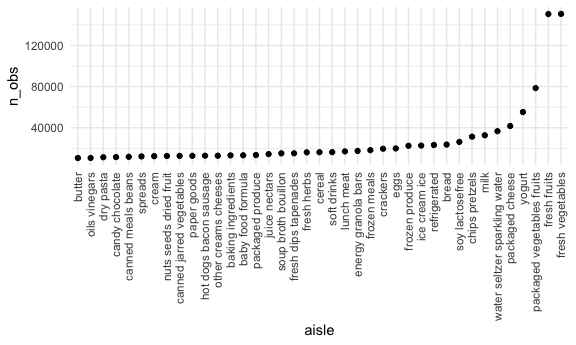
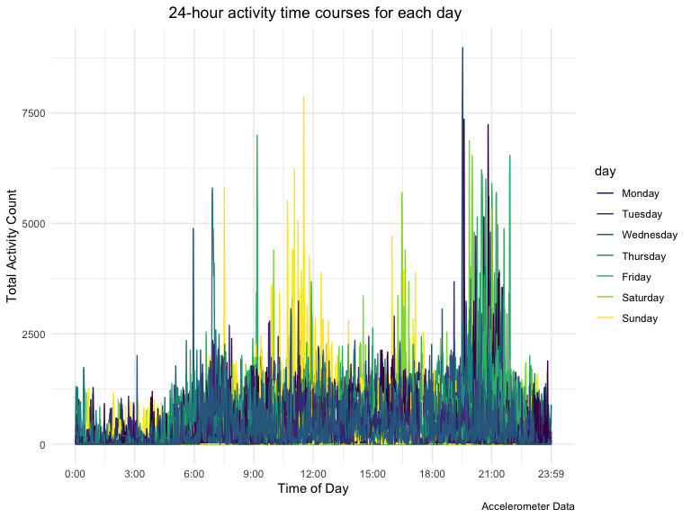

p8105_hw3_yc4195.RMD
================
Yimin Chen yc4195
2022-10-08

## Problem 1

``` r
data("instacart")


instacart %>%
  group_by(aisle) %>%
  summarize(n_obs = n())%>%
  arrange(desc(n_obs))%>%
  filter(n_obs > 10000)%>%
  ggplot(aes(x = aisle, y = n_obs,color =  aisle)) + geom_point()
```


Make a table showing the three most popular items in each of the aisles
“baking ingredients”, “dog food care”, and “packaged vegetables fruits”.
Include the number of times each item is ordered in your table.

``` r
instacart %>% 
  filter(aisle %in% c("baking ingredients", "dog food care", "packaged vegetables fruits")) %>% 
  group_by(aisle) %>% 
  count(product_name) %>% 
  mutate(rank = min_rank(desc(n))) %>% 
  filter(rank < 4) %>% 
  arrange(aisle, rank) %>% 
  knitr::kable(digits = 1)
```

| aisle                      | product_name                                  |    n | rank |
|:---------------------------|:----------------------------------------------|-----:|-----:|
| baking ingredients         | Light Brown Sugar                             |  499 |    1 |
| baking ingredients         | Pure Baking Soda                              |  387 |    2 |
| baking ingredients         | Cane Sugar                                    |  336 |    3 |
| dog food care              | Snack Sticks Chicken & Rice Recipe Dog Treats |   30 |    1 |
| dog food care              | Organix Chicken & Brown Rice Recipe           |   28 |    2 |
| dog food care              | Small Dog Biscuits                            |   26 |    3 |
| packaged vegetables fruits | Organic Baby Spinach                          | 9784 |    1 |
| packaged vegetables fruits | Organic Raspberries                           | 5546 |    2 |
| packaged vegetables fruits | Organic Blueberries                           | 4966 |    3 |

Make a table showing the mean hour of the day at which Pink Lady Apples
and Coffee Ice Cream are ordered on each day of the week; format this
table for human readers (i.e. produce a 2 x 7 table).

``` r
instacart %>% 
  filter(product_name %in% c("Pink Lady Apples", "Coffee Ice Cream")) %>% 
  group_by(product_name, order_dow) %>% 
  summarise(mean_hour = mean(order_hour_of_day)) %>% 
  pivot_wider(
    names_from = order_dow,
    values_from = mean_hour
  )%>% 
  knitr::kable()
```

    ## `summarise()` has grouped output by 'product_name'. You can override using the
    ## `.groups` argument.

| product_name     |        0 |        1 |        2 |        3 |        4 |        5 |        6 |
|:-----------------|---------:|---------:|---------:|---------:|---------:|---------:|---------:|
| Coffee Ice Cream | 13.77419 | 14.31579 | 15.38095 | 15.31818 | 15.21739 | 12.26316 | 13.83333 |
| Pink Lady Apples | 13.44118 | 11.36000 | 11.70213 | 14.25000 | 11.55172 | 12.78431 | 11.93750 |

## Problem 2

``` r
accel = 
  read_csv("./data/accel_data.csv", col_types = cols(
      week = col_integer(),
      day_id = col_integer()
      )) %>%
  janitor::clean_names() %>% 
  mutate(
    weekend = case_when(
      day == "Monday" ~ "weekday",
      day == "Tuesday" ~ "weekday",
      day == "Wednesday" ~ "weekday",
      day == "Thursday" ~ "weekday",
      day == "Friday" ~ "weekday",
      day == "Saturday" ~ "weekend",
      day == "Sunday" ~ "weekend"
)) %>% 
  pivot_longer(
    activity_1:activity_1440, 
    names_to = "activity",
    values_to = "activity_count") %>% 
  separate(activity, into = c("activity", "activity_time")) %>%
  select(-activity) %>%
  mutate(
    day_id = as.factor(day_id),
    day = factor(day),
    day = forcats::fct_relevel(day, c("Monday", "Tuesday", "Wednesday", "Thursday", "Friday", "Saturday", "Sunday")),
    activity_count = as.numeric(activity_count)
    )
```

The Accelerometers dataset uses five weeks of accelerometer data
collected on a 63 year-old male with BMI 25, who was admitted to the
Advanced Cardiac Care Center of Columbia University Medical Center and
diagnosed with congestive heart failure (CHF). The Accelerometers
dataset has 50400 rows and 6 columns. The variables in this dataset are
week, day_id, day, weekend, activity_time, activity_count. I create a
new variable named ‘weekend’ to indicate whether the day observed is
during weekdays or weekends. Also, I convert `day` variable from a
character variable to a factor variable.

``` r
accel_table <-
  accel %>% 
  group_by(day_id, day, week) %>%
  summarize(total_activity = sum(activity_count)) %>% 
  knitr::kable(digits = 0)
```

    ## `summarise()` has grouped output by 'day_id', 'day'. You can override using the
    ## `.groups` argument.

``` r
accel_table
```

| day_id | day       | week | total_activity |
|:-------|:----------|-----:|---------------:|
| 1      | Friday    |    1 |         480543 |
| 2      | Monday    |    1 |          78828 |
| 3      | Saturday  |    1 |         376254 |
| 4      | Sunday    |    1 |         631105 |
| 5      | Thursday  |    1 |         355924 |
| 6      | Tuesday   |    1 |         307094 |
| 7      | Wednesday |    1 |         340115 |
| 8      | Friday    |    2 |         568839 |
| 9      | Monday    |    2 |         295431 |
| 10     | Saturday  |    2 |         607175 |
| 11     | Sunday    |    2 |         422018 |
| 12     | Thursday  |    2 |         474048 |
| 13     | Tuesday   |    2 |         423245 |
| 14     | Wednesday |    2 |         440962 |
| 15     | Friday    |    3 |         467420 |
| 16     | Monday    |    3 |         685910 |
| 17     | Saturday  |    3 |         382928 |
| 18     | Sunday    |    3 |         467052 |
| 19     | Thursday  |    3 |         371230 |
| 20     | Tuesday   |    3 |         381507 |
| 21     | Wednesday |    3 |         468869 |
| 22     | Friday    |    4 |         154049 |
| 23     | Monday    |    4 |         409450 |
| 24     | Saturday  |    4 |           1440 |
| 25     | Sunday    |    4 |         260617 |
| 26     | Thursday  |    4 |         340291 |
| 27     | Tuesday   |    4 |         319568 |
| 28     | Wednesday |    4 |         434460 |
| 29     | Friday    |    5 |         620860 |
| 30     | Monday    |    5 |         389080 |
| 31     | Saturday  |    5 |           1440 |
| 32     | Sunday    |    5 |         138421 |
| 33     | Thursday  |    5 |         549658 |
| 34     | Tuesday   |    5 |         367824 |
| 35     | Wednesday |    5 |         445366 |

From the generated table, we can see during Saturday in week 4 and 5,
the total activity falls into a lowest value.Overall, there isn’t a
clear trend for total activity pattern for each day.

``` r
accel_plot <-
  accel%>% 
  group_by(day, day_id) %>% 
  mutate(activity_time = parse_number(activity_time)) %>% 
  ggplot(aes(x = activity_time, y = activity_count, group = day_id, color = day)) + 
  labs(
    title = " 24-hour activity time courses for each day",
    x = "Time of Day",
    y = "Total Activity Count",
    caption = "Accelerometer Data"
  ) + 
 scale_x_continuous(
    breaks = c(0, 180, 360, 540, 720, 900, 1080, 1260, 1440),
    labels = c("0:00", "3:00", "6:00", "9:00", "12:00", "15:00", "18:00", "21:00", "23:59"),
    limits = c(0, 1440)) +
  geom_line()
accel_plot
```



Most of the activities focus on morning to noon (9am to 12) and evening
(7pm to 11pm).On Sunday, participants tend to be more active during the
noon.

## Problem 3

``` r
data("ny_noaa")
```

The ny_noaa dataset contains informationaccessed from the NOAA National
Climatic Data Center. The ataset has 2595176 rows and 7 columns.The
variables in this dataset are id, date, prcp, snow, snwd, tmax, tmin .
`id`: the Weather station ID `date`: Date of observation `prcp`:
Precipitation `tmax`: Maximum temperature `tmin`: Minimum temperature
`snow`: Snowfall (mm) `snwd`: Snow depth (mm) The extent to which
missing data is an issue is determined by whether the data is missing at
random since the station may not collect some precipitation or snow
data.

``` r
noaa_df = ny_noaa %>% 
  janitor::clean_names() %>% 
  separate(date, into = c("year", "month", "day"), convert = TRUE) %>%
  mutate(
    year = as.numeric(year),
    month = as.numeric(month),
    day = as.numeric(day),
    tmax = as.numeric(tmax) / 10,
    tmin = as.numeric(tmin) / 10,
    prcp = prcp / 10 )
```

``` r
noaa_df %>% 
  group_by(snow) %>% 
    summarize(
        n_obs_snow = n()
    ) %>% 
    arrange(-n_obs_snow)
```

    ## # A tibble: 282 × 2
    ##     snow n_obs_snow
    ##    <int>      <int>
    ##  1     0    2008508
    ##  2    NA     381221
    ##  3    25      31022
    ##  4    13      23095
    ##  5    51      18274
    ##  6    76      10173
    ##  7     8       9962
    ##  8     5       9748
    ##  9    38       9197
    ## 10     3       8790
    ## # … with 272 more rows

From the data, you can see see most commonly observed values for
snowfall are `0` (n = 2,008,508) ,which indicates it’s not snowing for
most days at NYC. It makes sence since snow days will only occur during
some cold days but all the other days are warm. Also, `NA` (n = 381,221)
is the second commonly observed value for snowfall, which means there
are a lot of missing observations for snowfall. That’s also reasonable
since the station may not collect some precipitation or snow data on
certain days.

``` r
two_panel_plot = noaa_df %>% 
  filter(month %in% c("1", "7")) %>%
  group_by(id, year, month) %>%
  summarize(mean_tmax = mean(tmax,na.rm = TRUE))%>% 
   drop_na() %>% 
  ggplot(aes(x = year, y = mean_tmax, group = id, color = month)) +
  geom_point() +
  geom_smooth() +
  labs(
    title = "Average max temperature in January and July in each NYC station across years",
    x = "Year",
    y = "Average max temperature in January and July in each NYC station across years"
  ) +
  facet_grid(. ~ month)+
  theme_bw()+
  theme(legend.position = "none") 
two_panel_plot
```


The average maximum temperature in January ranged from -10°C to 10°C
degrees, with two severely points falling below -10°C degrees, which can
be seen as two outliers.The average maximum temperature in July ranged
from 20°C to 30°C degrees, and it seems to have 4 outliers in total.
Overall, the average maximum temperature in January seems to be much
lower than the average maximum temperature in July, but the average
maximum temperature of Jan seems to have more fluctuations (more
broader) than that of July.

``` r
plot1=
  noaa_df %>%
  drop_na(tmin, tmax) %>% 
  ggplot(aes(x = tmin, y = tmax)) +
  geom_hex() +
  labs(
    title = "Daily temperature 1981-2010",
    x = "Minimum temperature (Celsius)",
    y = "Maximum temperature (Celsius)"
  ) + 
  theme(legend.position = "right")
plot2=
  noaa_df %>%
  filter(snow > 0 ,snow < 100) %>%
  group_by(year) %>%
  ggplot(aes(x = year, y = snow,group = year)) +
  geom_boxplot(fill = 'pink') + 
  labs(
    title = 'NY Snowfall value by year',
    y = 'Snowfall in mm',
    x = 'Year'
  )
plot1 / plot2  
```


